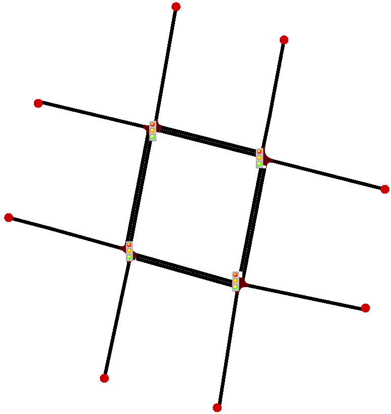

# Privacy-V2X
Explore privacy-preserving distributed learning in traffic simulations using Python, TraCI-SUMO, sumo-rl and Flower Framework. Implement and analyze privacy-enhancing techniques for secure, real-time interaction.

## Q-learning

This project is based on the sumo-rl framework. The scenario features a SUMO map with four intersections, each controlled by a traffic light. Since it’s a one-way street with no turns, there are only two phases.


The simulation is executed by running `ql.py`:

```bash
python3 ql.py
```

As a result, there is a reduction in waiting time and CO2 emissions.


## Federated Learning

The objective is to federate the proposed scenario, where each traffic light is considered a different client on separate maps.


The simulation configuration is done in `client.py` and `server.py`. To run the simulation, start the server with the following command:

```bash
python3 server.py
```

Clients can be executed with `run_clients.sh`, or if you want to assign a specific number of cores to each client, use `run_clients_parallel.sh`.
