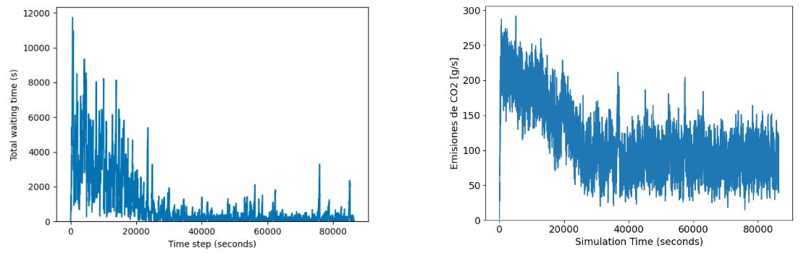
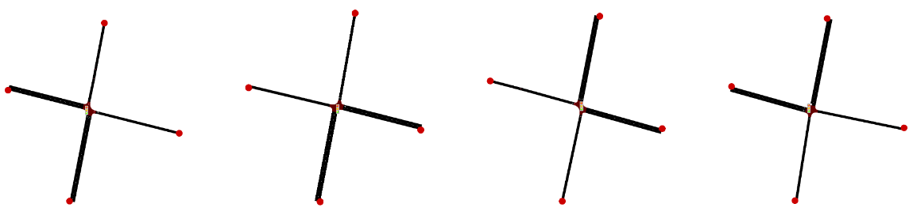
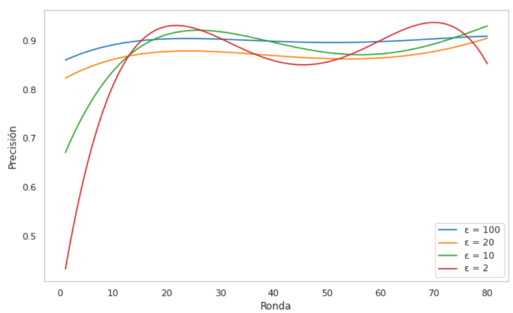

# Privacy-V2X
Explore privacy-preserving distributed learning in traffic simulations using Python, TraCI-SUMO, [sumo-rl](https://github.com/LucasAlegre/sumo-rl) and [Flower Framework](https://github.com/adap/flower). Implement and analyze privacy-enhancing techniques for secure, real-time interaction.

## Q-learning

This project is based on the sumo-rl framework. The scenario features a SUMO map with four intersections, each controlled by a traffic light. Since it’s a one-way street with no turns, there are only two phases.


The simulation is executed by running `ql.py`:

```bash
python3 ql.py
```

As a result, there is a reduction in waiting time and CO2 emissions.



## Federated Learning

The objective is to federate the proposed scenario, where each traffic light is considered a different client on separate maps.



The simulation configuration is done in `client.py` and `server.py`. The client and server code allows the Q-tables of the clients to be shared with the server, which averages the actions for similar states. The code leverages the Flower Framework. To run the simulation, start the server with the following command:

```bash
python3 server.py
```

Clients can be executed with `run_clients.sh`, or if you want to assign a specific number of cores to each client, use `run_clients_parallel.sh`.


A reduction in waiting time and CO2 emissions is achieved as the federated rounds progress.


`client_dp.py` allows the use of `LocalDpMod` to perform accuracy tests with different epsilon values.



